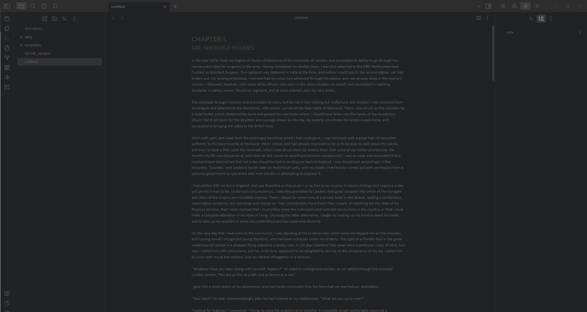

# obsidian-covert-theme
When you're in a coffeehouse or library, or just in public, but you want to work in [Obsidian](https://obsidian.md/), this theme is exactly what you need if you **want to write in private**.
As you can see below, this theme has a dark background, and the text is only a bit lighter than the background making it hard to read at a distance.
General suggestions would be to:
- Use with a smaller font that can be changed in the Obsidian Settings
- Turn down your screen brightness to where the text is just visable to you, right in front of the screen.

Keep in mind that this doesn't fully hide your text, but makes it a lot harder to see for the nosey person sitting at that table behind you.
Also, as this is just a theme CSS change, let me make it clear that there is no type of encryption on your files, or any other mechanism to keep your data secret should someone else have access to the device Obsidian is running on.
That being said, enjoy writing in a more covert fashion!

Built off of the [Obsidian Nord](https://github.com/insanum/obsidian_nord) theme by Insanum. Thank you!

